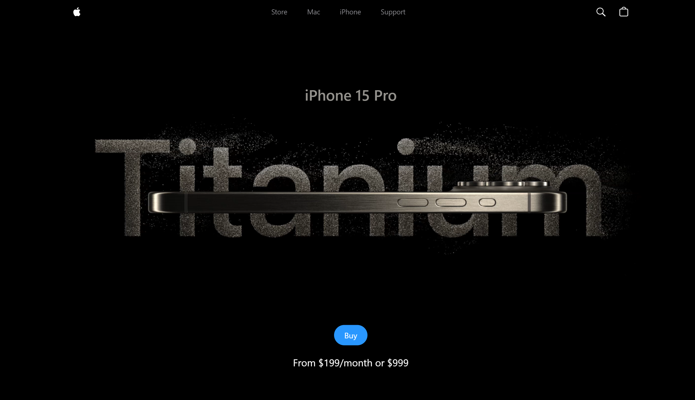

# React + Vite Apple iPhone Promotion Website

This project is a web application that showcases an Apple iPhone promotion using React, Vite, and Three.js. 
<video controls src="20240827-1211-10.9794696.mp4" title="iphone"></video>

<video controls src="20240827-1246-49.3987245.mp4" title="3d"></video>


## Getting Started

Follow these steps to run the project locally.

### Prerequisites

- [Node.js](https://nodejs.org/en/) (v14.18.0 or later)
- [npm](https://www.npmjs.com/) or [Yarn](https://yarnpkg.com/) package manager

### Installation

Clone the repository to your local machine and install the necessary dependencies:

```bash
git clone https://github.com/your_username/your_project_name.git
cd your_project_name
npm install
